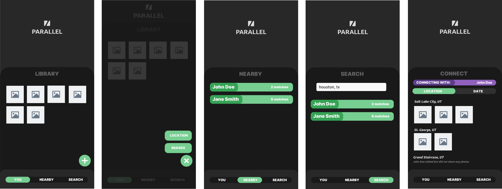

# PARALLEL

An app for discovering quick connections using your photo library.

## 🚀 Specification Deliverable

- [x] Proper use of Markdown
- [x] A concise and compelling elevator pitch
- [x] Description of key features
- [x] Description of how you will use each technology
- [x] One or more rough sketches of your application. Images must be embedded in this file using Markdown image references.

### Elevator pitch

So often you miss out on connections with people because you just don't know that it's something you have in common -- it just never comes up in conversation. But everyone loves taking photos at their favorite or most important places. Parallel quickly finds those connections by cross-referencing your photo library with others -- instantly finding connections you might have never discovered otherwise!

### Design

App Flow
- Pages include login/register, personal library, person search, and connect
- Bottom Navigation
- Mobile-first

Data flow
- Auth data stored in Atlas
- Photo storage in S3 bucket(s) (or possibly EFS)
- Search results handled by server
- Connect page is just the Personal Library page but using another person's data
- Metadata and location extraction/processing handled by 3rd-party API (Google)

### Key features

- Persistent photo library
- Comparing photos with similar data with others

### Technologies

I am going to use the required technologies in the following ways.

- **HTML** - Core UI structure
- **CSS** - UI visuals
- **React** - Improved UI
- **Service** - Authentication and login. Location names via Google API
- **DB/Login** - Accounts and data storage
- **WebSocket** - Person search and comparison

## 🚀 AWS deliverable

For this deliverable I did the following. I checked the box `[x]` and added a description for things I completed.

- [x] **Server deployed and accessible with custom domain name** - [My server link](https://dougalcaleb.click).

## 🚀 HTML deliverable

For this deliverable I did the following. I checked the box `[x]` and added a description for things I completed.

- [x] **HTML pages** - Added landing, login, library, connect, nearby search, and user search pages
- [x] **Proper HTML element usage** - Used proper HTML elements for appropriate page sections
- [x] **Links** - Included links from landing page to each other page, and from each individual page back to landing page
- [x] **Text** - Headers for each page, along with placeholder text for informational parts
- [x] **3rd party API placeholder** - Images fetched from Picsum; location names fetched from location coordinates via call to Google Maps API
- [x] **Images** - Images on Library and Connect pages
- [x] **Login placeholder** - Login page with username and password input
- [x] **DB data placeholder** - User's Library page
- [x] **WebSocket placeholder** - Nearby Search page

## 🚀 CSS deliverable

For this deliverable I did the following. I checked the box `[x]` and added a description for things I completed.

- [x] **Header, footer, and main content body** - Header with Parallel logo, contains nav on desktop. Footer on mobile with nav. Main content on all pages.
- [x] **Navigation elements** - Clickable, highlighted links for YOU/NEARBY/SEARCH (footer on mobile, header on desktop)
- [x] **Responsive to window resizing** - Breakpoint at 900px, continuously responsive without a refresh
- [x] **Application elements** - Library images, upload button, search box, nearby/search person card
- [x] **Application text content** - Headings, nav, text on person cards
- [x] **Application images** - Library images

## 🚀 React part 1: Routing deliverable

For this deliverable I did the following. I checked the box `[x]` and added a description for things I completed.

- [x] **Bundled using Vite** - React and Tailwind using Vite
- [x] **Components** - Components for root, login page, reused header/footer, other pages, and common components (input, person card, button)
- [x] **Router** - Router used to route between pages

## 🚀 React part 2: Reactivity deliverable

For this deliverable I did the following. I checked the box `[x]` and added a description for things I completed.

- [x] **All functionality implemented or mocked out** - Functionality implemented and reactive
- [x] **Hooks** - Hooks used (including custom useAuthUser hook) (library.jsx, root.jsx, etc)

## 🚀 Service deliverable

For this deliverable I did the following. I checked the box `[x]` and added a description for things I completed.

- [x] **Node.js/Express HTTP service** - Express server, using Router to organize endpoint groups
- [x] **Static middleware for frontend** - CORS, file serving
- [x] **Calls to third party endpoints** - Google Geolocation API, AWS S3
- [x] **Backend service endpoints** - Endpoints for login, image URL fetching, username changes, etc
- [x] **Frontend calls service endpoints** - Wrappers on fetch() to facilitate easy post/get/etc requests
- [x] **Supports registration, login, logout, and restricted endpoint** - Login/logout with either Google account or email, all endpoints require auth

## 🚀 DB deliverable

For this deliverable I did the following. I checked the box `[x]` and added a description for things I completed.

- [x] **Stores data in MongoDB** - Persistent user data stored in Mongo
- [x] **Stores credentials in MongoDB** - User credentials stored in Mongo

## 🚀 WebSocket deliverable

For this deliverable I did the following. I checked the box `[x]` and added a description for things I completed.

- [x] **Backend listens for WebSocket connection** - Backend uses WebsocketManager to handle websocket connections
- [x] **Frontend makes WebSocket connection** - Websocket connection made on image upload
- [x] **Data sent over WebSocket connection** - Geolocation data is sent back to client as queue processes it
- [x] **WebSocket data displayed** - Location displayed per-image
- [ ] **Application is fully functional** - I did not complete this part of the deliverable.
